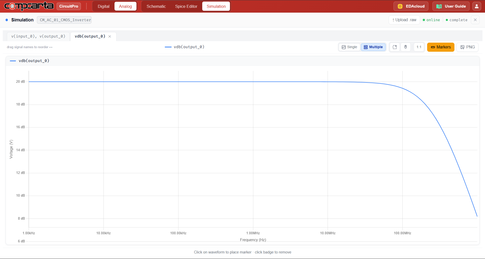
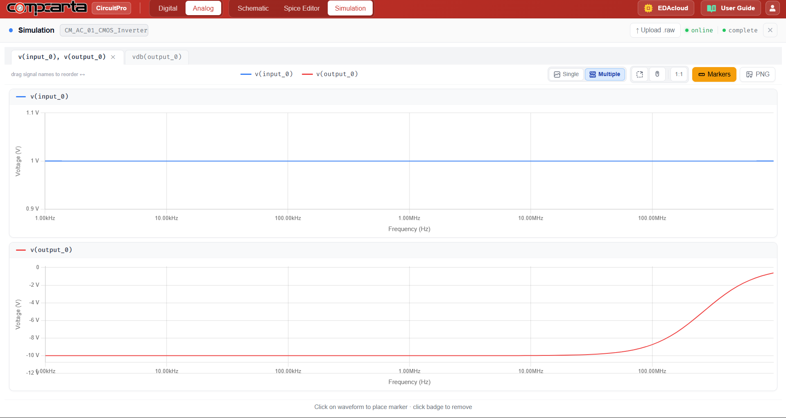
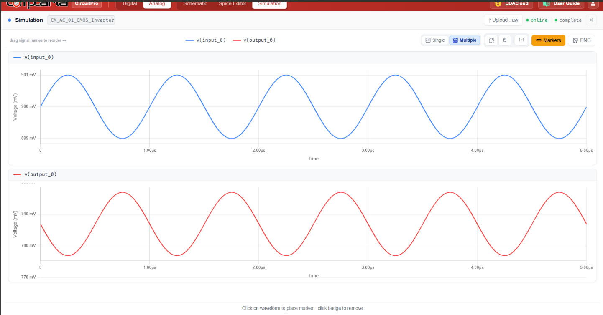

# CM-AC-01 — CMOS Inverter as Linear Amplifier

**Category:** Amps | **Complexity:** Intermediate | **Analysis:** AC | **VDD:** 1.8V

## Overview

When biased at its switching threshold VM via a large feedback resistor (RF = 1MΩ), the CMOS inverter operates as a linear amplifier. Both NMOS and PMOS are simultaneously in saturation, contributing their transconductances (gmn + gmp) to the total gain. This experiment measures the AC gain and bandwidth, and also verifies the bias point with a transient sine wave test.

## Sizing

| Device | W (µm) | L (µm) |
|:-------|-------:|-------:|
| NMOS   |   0.42 |   0.15 |
| PMOS   |   0.84 |   0.15 |

## Test Setup

- RF = 1MΩ feedback resistor sets DC bias at VM
- AC sweep: 1kHz → 1GHz, Vin = 1mVpp small signal
- Transient: 1mVpp sine input to verify linear operation
- CL = 10fF load capacitance

## Results

| Metric     | Target         | Result  |
|:-----------|:---------------|:--------|
| DC gain Av | −10 to −30 V/V | ✅ Pass |
| BW         | Set by CL      | ✅ Pass |
| Bias point | Near VM = 0.9V | ✅ Pass |

## Key Insight

The gain is Av = −(gmn + gmp)·(ron ∥ rop). Using both transistors' transconductances in parallel gives roughly twice the gain of a single-transistor common-source stage — a useful trick for simple single-stage amplification without extra bias circuitry.

## Files

| File                                           | Description                 |
|:-----------------------------------------------|:----------------------------|
| `schematic.png`                                | Circuit schematic           |
| `schematic_raw.json`                           | CircuitPro schematic export |
| `results/ac_gain_frequency_response.png`       | AC gain plot                |
| `results/ac_input_output_frequency_sweep.png`  | Input/output AC sweep       |
| `results/transient_input_output_sine.png`      | Transient sine verification |
