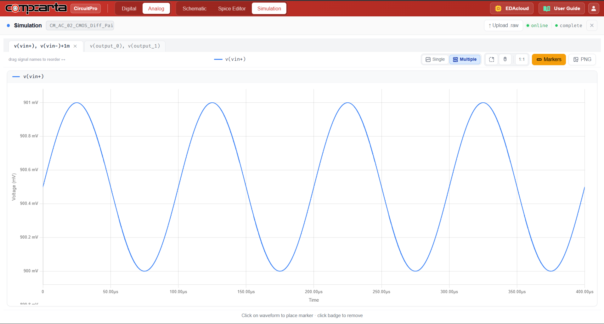
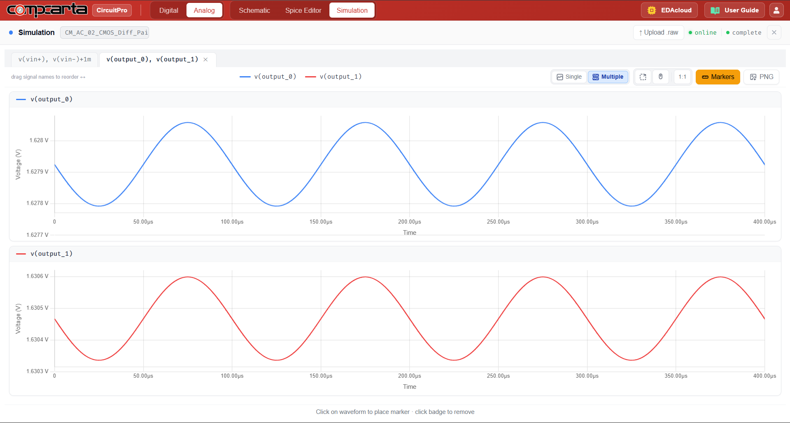

# CM-AC-02 — CMOS Differential Pair with Resistive Load
**Category:** Amps | **Complexity:** Intermediate | **Analysis:** AC | **VDD:** 1.8V

## Overview
An NMOS differential pair with a PMOS current-source tail and resistive drain loads. This is the foundational building block of virtually every analog front-end. The experiment measures differential-mode gain (Adm) and common-mode rejection ratio (CMRR). The tail current source is what makes CMRR meaningful — without it, common-mode signals would pass straight through.

## Sizing
| Device    | W (µm) | L (µm) |
|:----------|-------:|-------:|
| NMOS pair |   4.00 |   0.35 |

## Test Setup
- Vid = 1mVpp differential input at 10kHz
- Vcm = 0.9V common-mode bias
- Adm measured as Vout/Vid
- CMRR = 20·log(Adm/Acm)

## Results

| Metric | Target    | Result  |
|:-------|:----------|:--------|
| Adm    | ≈ 15 V/V  | ✅ Pass |
| CMRR   | > 40dB    | ✅ Pass |

## Key Insight
CMRR is primarily determined by how well the tail current source rejects common-mode signals. A simple PMOS current source provides moderate CMRR — upgrading to a cascode tail (CM-AC-04) pushes this well above 80dB.

## Files
| File                                          | Description                   |
|:-----------------------------------------------|:-------------------------------|
| `schematic.png`                                | Circuit schematic              |
| `schematic_raw.json`                           | CircuitPro schematic export    |
| `results/differential_input_transient.png`     | Differential input waveform    |
| `results/differential_output_transient.png`    | Differential output waveform   |
