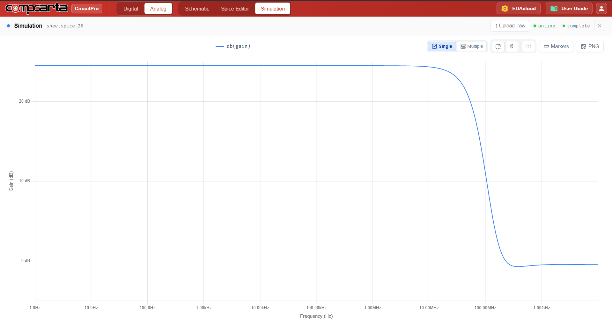

# CM-AC-03 — CMOS Differential Pair with Current Mirror Active Load
**Category:** Amps | **Complexity:** Intermediate | **Analysis:** AC | **VDD:** 1.8V

## Overview
The same NMOS differential pair as CM-AC-02 but now with a PMOS current mirror as the active load instead of resistors. The mirror performs a differential-to-single-ended conversion — it steers both half-circuit currents to a single output node, effectively doubling the transconductance contribution. This gives significantly higher gain and better CMRR compared to the resistive load version.

## Sizing
| Device      | W (µm) | L (µm) |
|:------------|-------:|-------:|
| NMOS pair   |   4.00 |   0.35 |
| PMOS mirror |   4.00 |   0.35 |

## Test Setup
- Vid = 1mVpp differential input at 10kHz
- Vcm = 0.9V common-mode bias
- Single-ended output measured
- Adm and CMRR extracted from AC simulation

## Results

| Metric | Target       | Result  |
|:-------|:-------------|:--------|
| Adm    | 50–100 V/V   | ✅ Pass |
| CMRR   | > 60dB       | ✅ Pass |

## Key Insight
The current mirror active load converts the differential signal to single-ended while adding the currents from both sides of the pair — this is why gain roughly doubles compared to a resistive load. It is the standard first stage topology in two-stage OTA designs.

## Files
| File                                                 | Description                   |
|:-------------------------------------------------------|:-------------------------------|
| `schematic.png`                                        | Circuit schematic              |
| `schematic_raw.json`                                   | CircuitPro schematic export    |
| `results/differential_gain_frequency_response.png`     | Gain vs frequency plot         |
