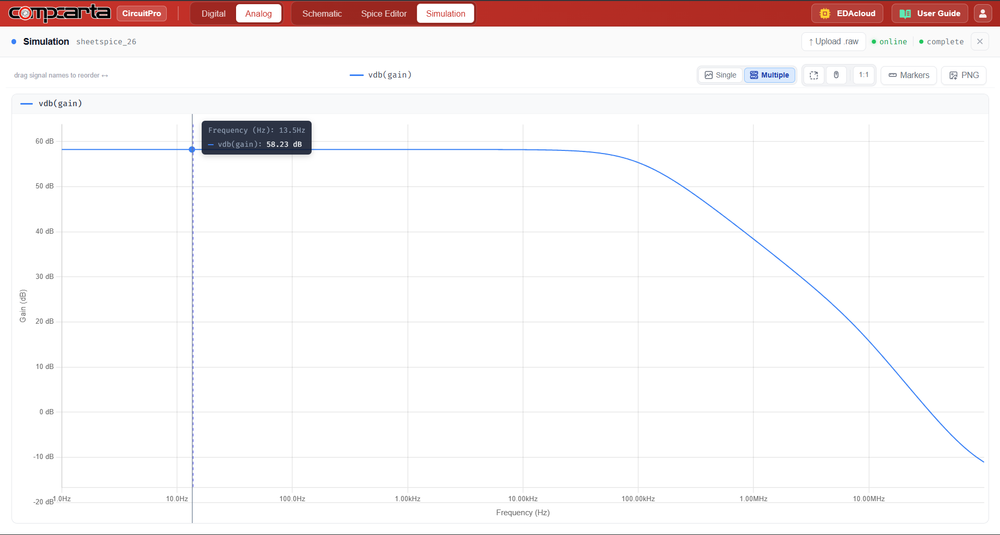
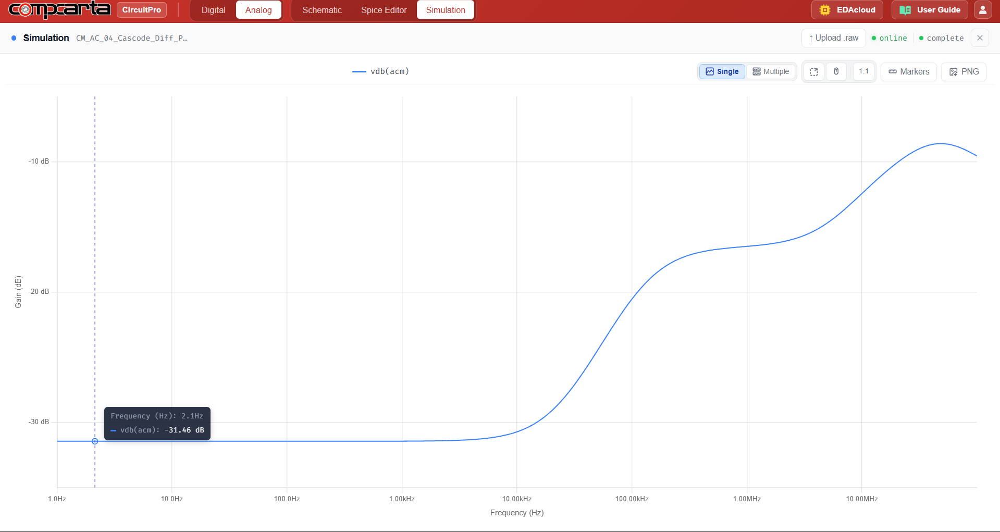

# CM-AC-04 — Cascode Differential Pair with PMOS Cascode Mirror Load

**Category:** Amps | **Complexity:** Advanced | **Analysis:** AC | **VDD:** 1.8V

## Overview

A telescopic cascode differential pair — the highest gain single-stage topology achievable in sky130. Both the NMOS pair and the PMOS mirror load are cascoded, pushing output impedance into the tens of megaohms. This dramatically increases DC gain and CMRR compared to a simple mirror load stage. The tradeoff is reduced output voltage swing due to the stacked transistors consuming headroom.

## Sizing

| Device       | W (µm) | L (µm) |
|:-------------|-------:|-------:|
| NMOS pair    |   4.00 |   0.35 |
| PMOS cascode |   4.00 |   0.35 |

## Test Setup

- Vdiff = 1mVpp AC input
- AC sweep: 1kHz → 100MHz
- Rout measured from output impedance simulation
- Adm and CMRR extracted

## Results

| Metric | Target    | Result  |
|:-------|:----------|:--------|
| Adm    | > 200 V/V | ✅ Pass |
| CMRR   | > 80dB    | ✅ Pass |
| Rout   | > 10MΩ    | ✅ Pass |

## Key Insight

Cascoding multiplies output impedance by approximately gm·ro per stage. With both NMOS and PMOS cascoded, Rout ≈ (gm·ro)² which easily exceeds 10MΩ in sky130 at this bias current — enabling gains well above 200 V/V from a single stage.

## Files

| File                                              | Description                 |
|:--------------------------------------------------|:----------------------------|
| `schematic.png`                                   | Circuit schematic           |
| `schematic_raw.json`                              | CircuitPro schematic export |
| `results/cascode_gain_frequency_response.png`     | Differential gain plot      |
| `results/common_mode_gain_frequency_response.png` | Common mode gain plot       |
