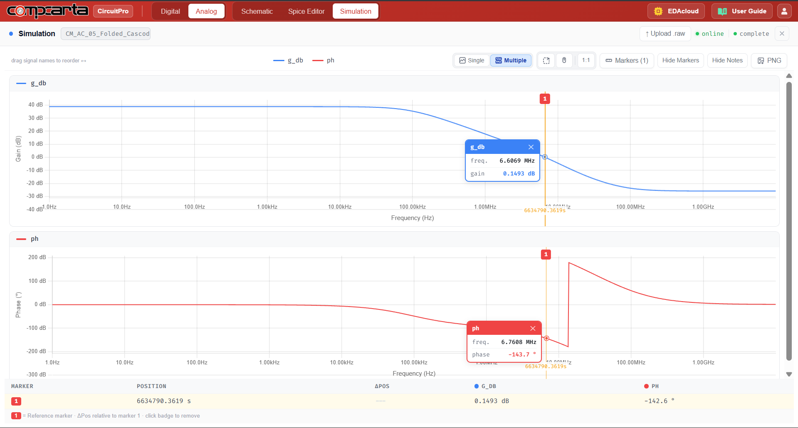
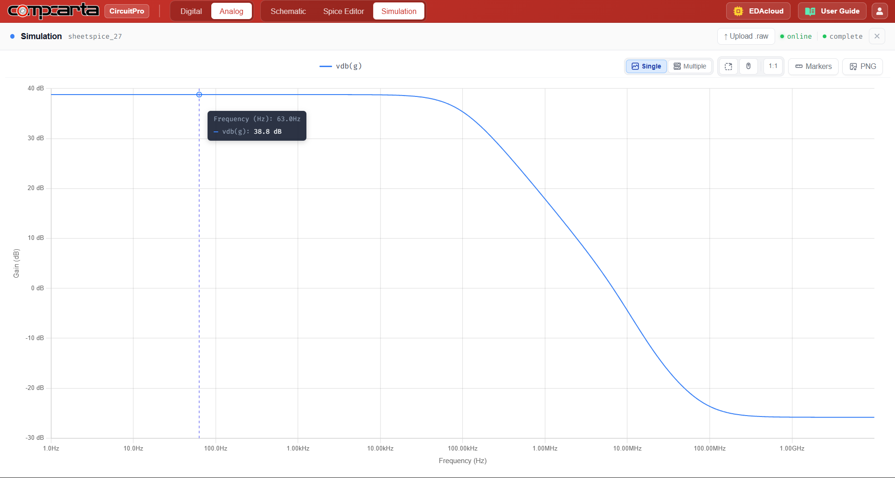

# CM-AC-05 — Folded-Cascode OTA
**Category:** OTA | **Complexity:** Advanced | **Analysis:** AC | **VDD:** 1.8V

## Overview
A folded-cascode OTA with a PMOS input differential pair, NMOS cascode fold, and cascode mirror load driving a 5pF load. Folding the cascode allows a wider input common-mode range compared to a telescopic design while maintaining high output impedance. This is one of the most practical OTA topologies for sky130 analog design.

## Sizing
| Device       | W (µm) | L (µm) |
|:-------------|-------:|-------:|
| PMOS input   |   8.00 |   0.35 |
| NMOS cascode |   8.00 |   0.35 |

## Test Setup
- Open-loop AC sweep with 5pF load
- Unity-gain configuration for phase margin measurement
- GBW and DC gain extracted from Bode plot

## Results

| Metric  | Target  | Result  |
|:--------|:--------|:--------|
| GBW     | > 50MHz | ✅ Pass |
| PM      | > 60°   | ✅ Pass |
| DC gain | > 70dB  | ✅ Pass |

## Key Insight
Folding lets the input pair and cascode devices share the supply headroom more efficiently than a telescopic design. The wide input common-mode range makes this topology ideal for single-supply 1.8V systems where signal swings span a large fraction of VDD.

## Files
| File                                              | Description                    |
|:---------------------------------------------------|:--------------------------------|
| `schematic.png`                                    | Circuit schematic               |
| `schematic_raw.json`                               | CircuitPro schematic export     |
| `results/bode_plot_gain_phase.png`                 | Gain and phase Bode plot        |
| `results/open_loop_gain_frequency_response.png`    | Open loop gain plot             |
