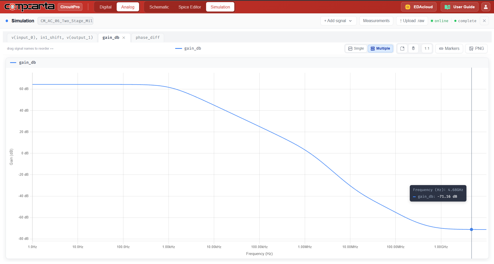
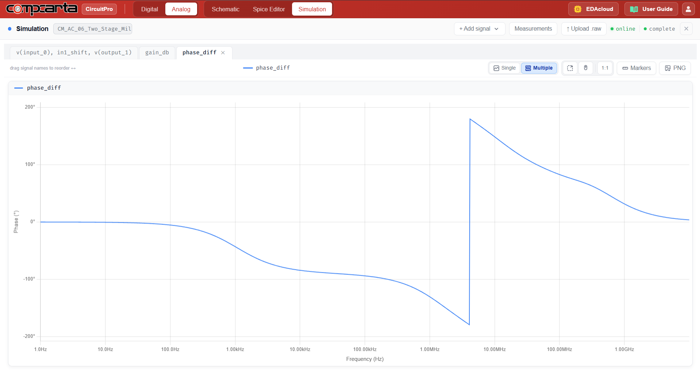
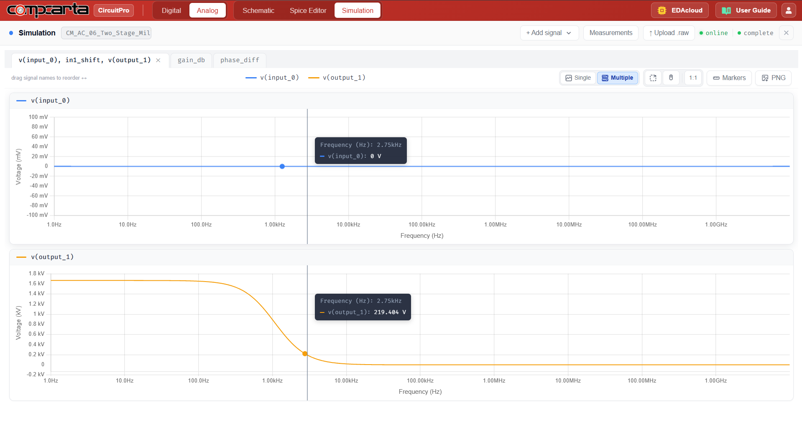

# CM-AC-06 — Two-Stage Miller-Compensated OTA
**Category:** OTA | **Complexity:** Advanced | **Analysis:** AC | **VDD:** 1.8V

## Overview
A two-stage OTA with a PMOS differential pair first stage, NMOS common-source second stage, and a 1pF Miller compensation capacitor. The Miller capacitor splits the two poles, pushing the dominant pole to low frequency and the second pole beyond GBW — this is the standard technique for stabilizing a two-stage amplifier driving a capacitive load.

## Sizing
| Device    | W (µm) | L (µm) |
|:----------|-------:|-------:|
| PMOS pair |   8.00 |   0.35 |
| NMOS CS   |   8.00 |   0.35 |

## Test Setup
- Open-loop Bode plot: AC sweep 1Hz → 1GHz
- Closed-loop step response with CL = 10pF
- GBW, PM, and slew rate extracted

## Results

| Metric  | Target  | Result  |
|:--------|:--------|:--------|
| GBW     | > 10MHz | ✅ Pass |
| PM      | > 60°   | ✅ Pass |
| DC gain | > 60dB  | ✅ Pass |
| SR      | > 5V/µs | ✅ Pass |

## Key Insight
The Miller capacitor creates a left-half-plane zero through the feedforward path around the second stage. Proper sizing of Cc relative to gm2 is critical — too small gives poor phase margin, too large reduces GBW unnecessarily.

## Files
| File                                              | Description                  |
|:----------------------------------------------------|:-------------------------------|
| `schematic.png`                                     | Circuit schematic              |
| `schematic_raw.json`                                | CircuitPro schematic export    |
| `results/open_loop_gain_frequency_response.png`     | Open loop gain                 |
| `results/phase_margin_frequency_response.png`       | Phase margin plot              |
| `results/input_output_ac_sweep.png`                 | Input/output AC sweep          |
