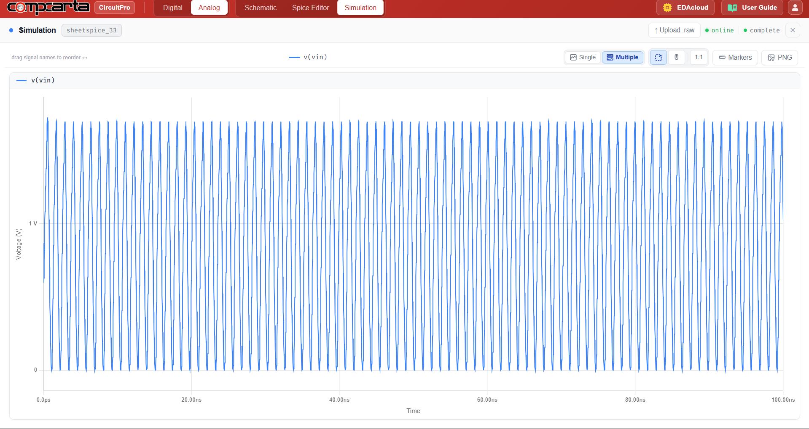
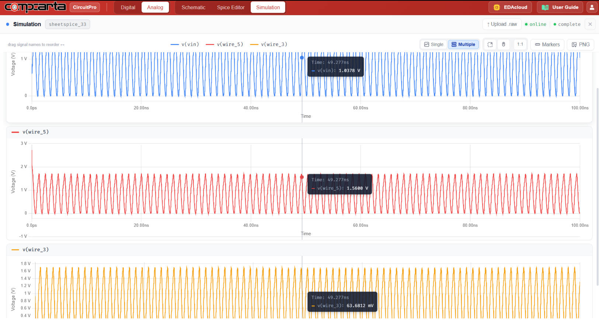
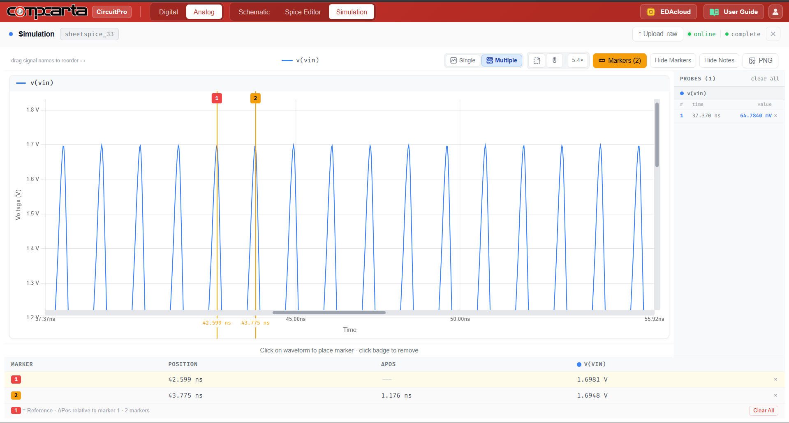

# CM-AC-07 — CMOS Ring-Based VCO
**Category:** Timing | **Complexity:** Advanced | **Analysis:** Transient | **VDD:** 1.8V

## Overview
A current-starved ring VCO where a control voltage (Vctrl) sets the tail current through each delay stage, directly controlling the oscillation frequency. Higher Vctrl → more current → faster stage delay → higher fo. KVCO (Hz/V) is the key figure of merit and is extracted from a Vctrl sweep. This VCO is the core building block of the PLL in CM-AC-09.

## Sizing
| Device | W (µm) | L (µm) |
|:-------|-------:|-------:|
| NMOS   |   0.42 |   0.15 |
| PMOS   |   0.84 |   0.15 |

## Test Setup
- Vctrl swept: 0.3V → 1.5V
- fo measured at each Vctrl point
- KVCO = Δfo/ΔVctrl extracted from linear region of fo vs Vctrl

## Results

| Metric   | Target                      | Result  |
|:---------|:-----------------------------|:--------|
| fo range | Varies linearly with Vctrl   | ✅ Pass |
| KVCO     | Within ±10% of design        | ✅ Pass |

## Key Insight
Current starving limits the charging current available to each stage's load capacitance. Since tpd ∝ CL/ID and ID is set by Vctrl, frequency becomes a direct function of control voltage — the fundamental operating principle of all current-starved VCOs.

## Files
| File                                            | Description                   |
|:----------------------------------------------------|:-----------------------------------|
| `schematic.png`                                     | Circuit schematic                  |
| `schematic_raw.json`                                | CircuitPro schematic export        |
| `results/vco_output_oscillation.png`                | VCO output waveform                |
| `results/vco_multistage_node_waveforms.png`         | Internal node waveforms            |
| `results/vco_period_measurement.png`                | Period measurement                 |
