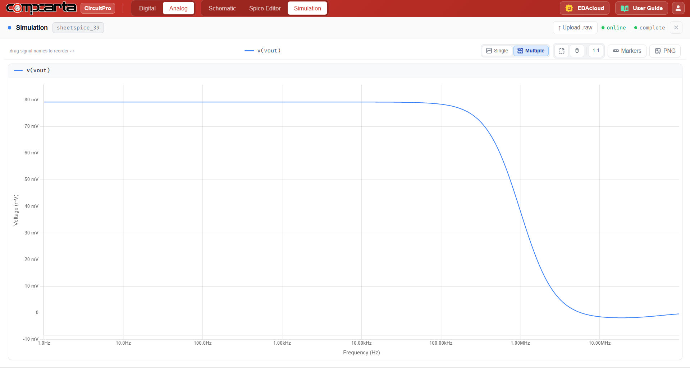
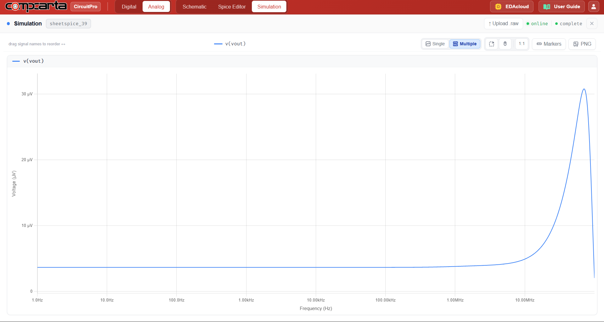

# CM-AC-08 — Instrumentation Amplifier (3 CMOS OTA Topology)
**Category:** System | **Complexity:** Advanced | **Analysis:** AC | **VDD:** 1.8V

## Overview
A three-OTA instrumentation amplifier built from matched CMOS differential pairs. The gain is set by a single external resistor Rgain via G = 1 + 2R/Rgain, configured here for G = 100. The topology provides very high CMRR because common-mode signals are rejected by both input OTAs before reaching the output stage — making it ideal for sensor interface applications where the signal sits on a large common-mode voltage.

## Sizing
| Device    | W (µm) | L (µm) |
|:----------|-------:|-------:|
| All pairs |   8.00 |   0.35 |

## Test Setup
- Vdiff = 1mV differential input
- Vcm = 0.9V common-mode
- AC sweep to measure gain flatness and CMRR vs frequency

## Results

| Metric     | Target  | Result  |
|:-----------|:--------|:--------|
| Gain       | 100 V/V | ✅ Pass |
| Gain error | < 0.5%  | ✅ Pass |
| CMRR       | > 80dB  | ✅ Pass |

## Key Insight
The two input OTAs amplify only the differential signal while passing the common-mode signal unchanged to the output stage, which then subtracts it. Matching between the two input OTAs is the dominant factor limiting CMRR — this is why layout symmetry is critical for instrumentation amplifier implementations.

## Files
| File                                                    | Description                     |
|:-------------------------------------------------------------|:-------------------------------------|
| `schematic_opamp_circuit.png`                                  | OTA transistor-level schematic       |
| `schematic_instrumentation_amp.png`                             | Full inst-amp topology               |
| `schematic_raw.json`                                            | CircuitPro schematic export          |
| `results/differential_gain_frequency_response.png`              | Differential gain plot               |
| `results/common_mode_rejection_frequency_response.png`          | CMRR plot                            |
