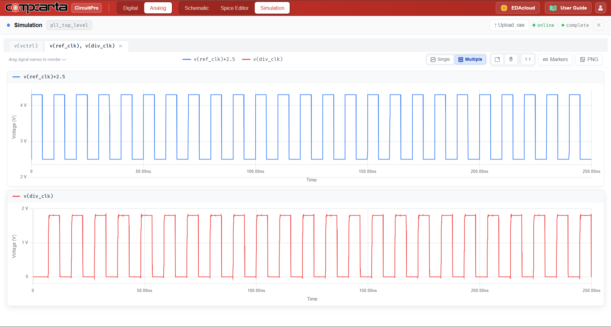
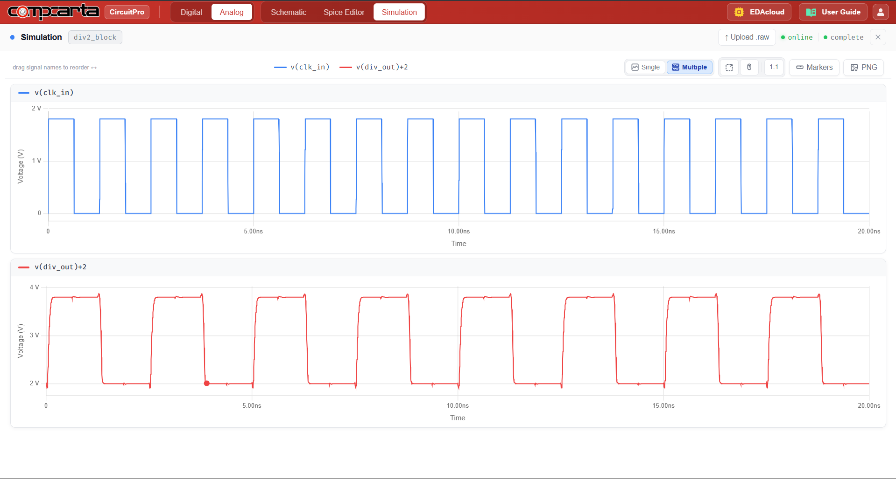
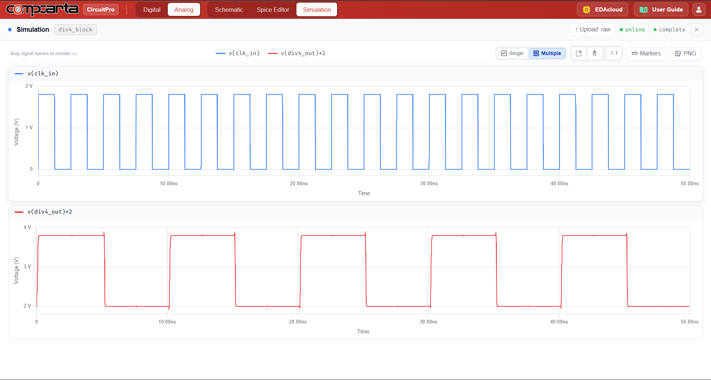
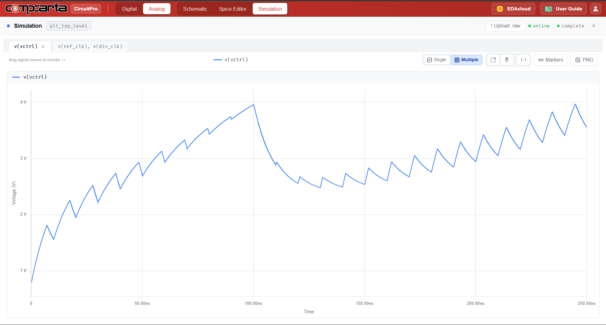
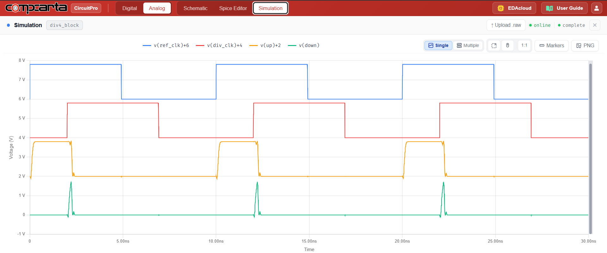
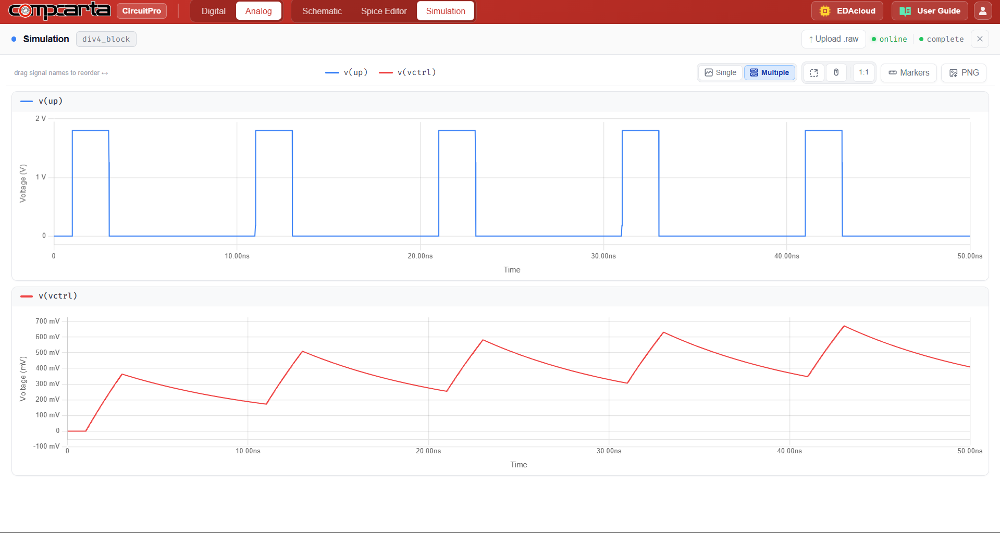
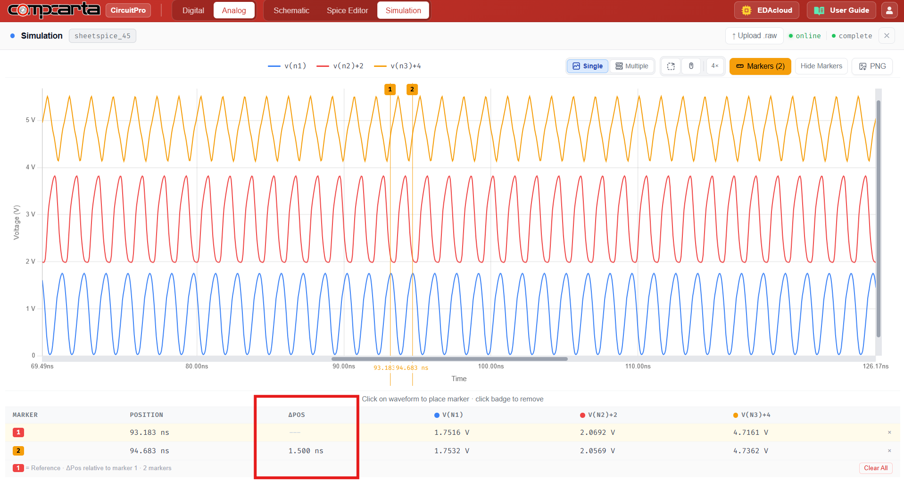

# CM-AC-09 — PLL VCO + Divider Block
**Category:** System | **Complexity:** Advanced | **Analysis:** AC + Transient | **VDD:** 1.8V

## Overview
A complete PLL building block consisting of the current-starved ring VCO from CM-AC-07, a ÷2 frequency divider, and a ÷4 divider chain. The open-loop KVCO is characterized first, then the closed-loop lock behavior is verified with Fref = 100MHz and divide ratio N = 4 targeting Fout = 400MHz. This is the most complex hierarchical circuit in this library — all sub-blocks were independently verified before integration.

## Sizing
| Device | W (µm) | L (µm) |
|:-------|-------:|-------:|
| NMOS   |   0.42 |   0.15 |
| PMOS   |   0.84 |   0.15 |

## Test Setup
- Vctrl sweep to extract KVCO open-loop
- Fref = 100MHz reference clock, N = 4 divider
- Closed-loop transient to verify lock at Fout = 400MHz

## Results

| Metric        | Target      | Result  |
|:---------------|:-------------|:--------|
| Lock @ 400MHz  | Verified     | ✅ Pass |
| KVCO           | Within ±10%  | ✅ Pass |

## Key Insight
The VCO gain KVCO must be matched carefully to the charge pump current and loop filter — too high and the loop becomes noisy, too low and lock time becomes excessive. The ÷4 divider is implemented as two cascaded ÷2 D-flip-flop blocks, keeping the design modular and independently testable.

## Files
| File                                                | Description                       |
|:----------------------------------------------------------|:----------------------------------------|
| `schematic_delay_cell.png`                                  | Single VCO delay cell                   |
| `schematic_vco_3stage.png`                                  | 3-stage VCO schematic                   |
| `schematic_inverter_cell.png`                                | Inverter cell used in divider           |
| `schematic_div2_block.png`                                   | ÷2 divider block                        |
| `schematic_div4_block.png`                                   | ÷4 divider chain                        |
| `schematic_raw.json`                                         | CircuitPro schematic export             |
| `results/pll_ref_div_clk_locked.png`                         | PLL locked waveform                     |
| `results/vco_output_oscillation.png`                         | VCO free-running output                 |
| `results/div2_clk_input_output.png`                          | ÷2 divider output                       |
| `results/div4_clk_input_output.png`                          | ÷4 divider output                       |
| `results/pll_vctrl_locking_transient.png`                    | Vctrl during lock acquisition           |
| `results/pfd_ref_div_up_down_waveforms.png`                  | PFD up/down signals                     |
| `results/pll_charge_pump_vctrl_waveform.png`                 | Charge pump output                      |
| `results/vco_multistage_period_measurement.png`              | VCO period measurement                  |
