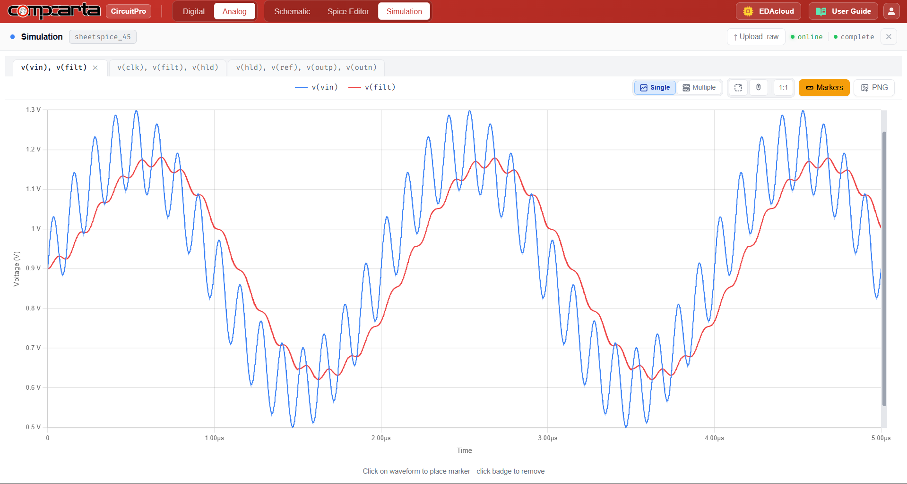
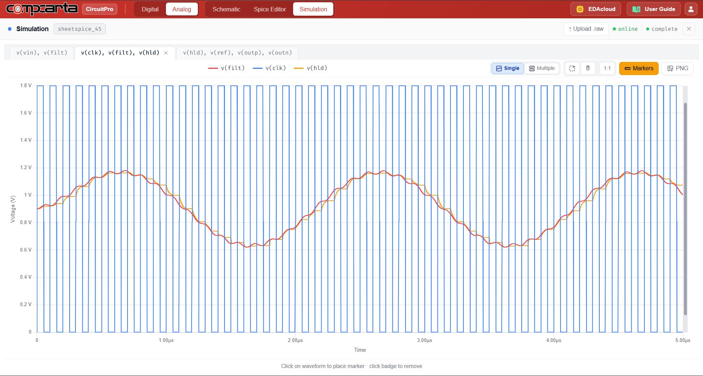
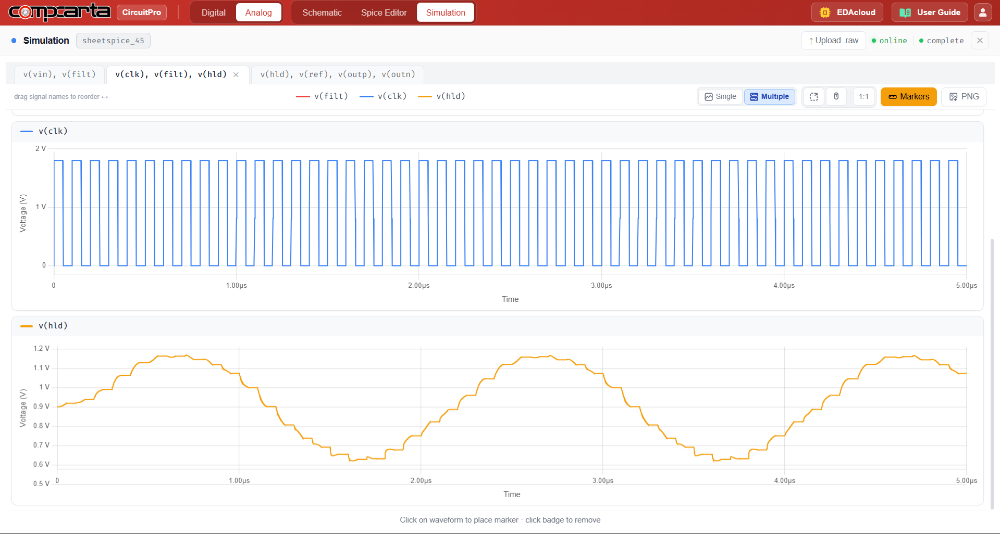
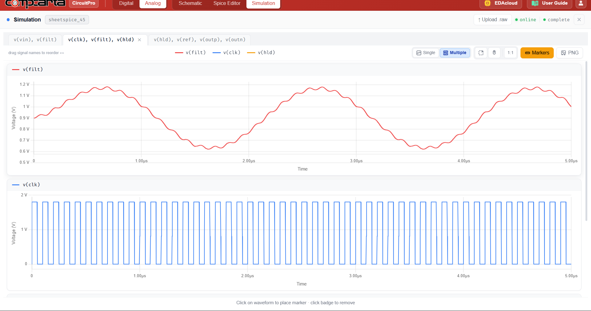
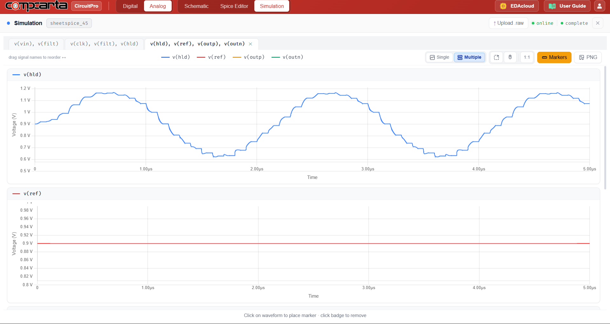
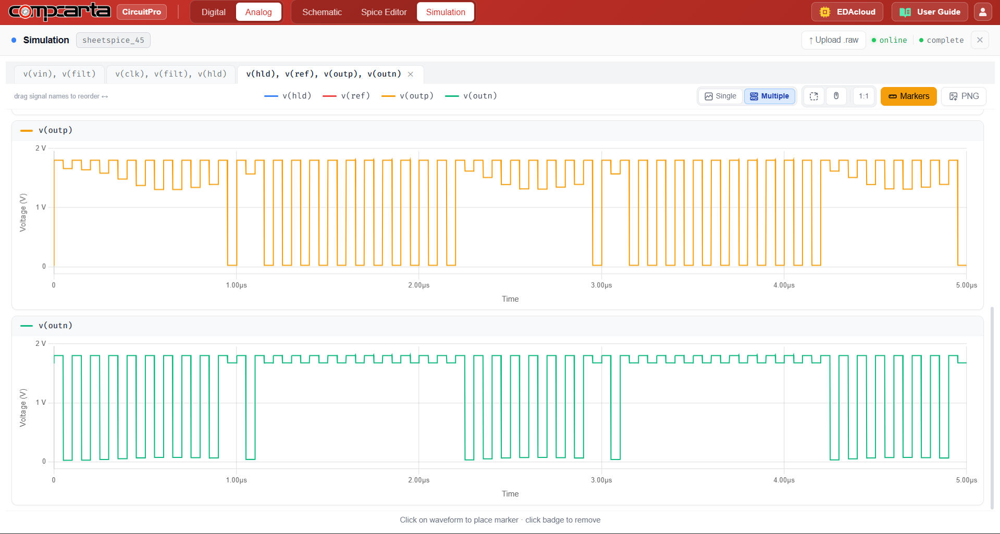
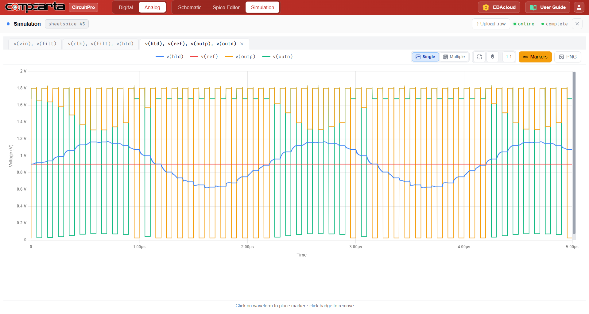

# CM-AC-10 — ADC Front-End (Anti-Alias Filter + Sample-Hold + Comparator)
**Category:** System | **Complexity:** Advanced | **Analysis:** AC + Transient | **VDD:** 1.8V

## Overview
A complete ADC signal chain front-end: an RC anti-aliasing low-pass filter attenuates out-of-band signals above fs/2, a CMOS transmission gate samples the filtered signal onto a hold capacitor, and a regenerative sense amplifier comparator resolves the held voltage against a reference. Each block was verified independently then tested as a chain with a sine input plus out-of-band noise.

## Sizing
| Device | W (µm) | L (µm) |
|:-------|-------:|-------:|
| NMOS   |   4.00 |   0.35 |
| PMOS   |   4.00 |   0.35 |

## Test Setup
- Input: in-band sine + out-of-band noise above fs/2
- fs = 10MHz sampling clock
- LPF cutoff below fs/2 to attenuate aliases
- ENOB estimated from comparator output

## Results

| Metric          | Target  | Result  |
|:-----------------|:--------|:--------|
| OOB attenuation   | > 20dB  | ✅ Pass |
| Sampling          | Correct | ✅ Pass |
| ENOB estimate     | > 8b    | ✅ Pass |

## Key Insight
The anti-alias filter is not optional — without it, signals above fs/2 fold back into the baseband and corrupt the sampled data permanently. The TG sample-hold captures the filtered signal with full-swing accuracy, and the regenerative comparator resolves it faster than a conventional differential pair would.

## Files
| File                                             | Description                          |
|:--------------------------------------------------------|:-------------------------------------------|
| `schematic.png`                                            | Full front-end schematic                   |
| `schematic_raw.json`                                       | CircuitPro schematic export                |
| `results/lpf_input_filtered_output.png`                    | LPF input vs output                        |
| `results/filtered_signal_clk_sample.png`                   | Filtered signal at sampling instant        |
| `results/clk_hold_voltage_waveform.png`                    | CLK and hold node                          |
| `results/clk_filt_hold_overlapped.png`                     | CLK, filter, hold overlaid                 |
| `results/hold_vs_reference_voltage.png`                    | Hold voltage vs reference                  |
| `results/comparator_outp_outn_waveform.png`                | Comparator differential output             |
| `results/full_chain_hld_ref_outp_outn.png`                 | Full chain signals                         |
