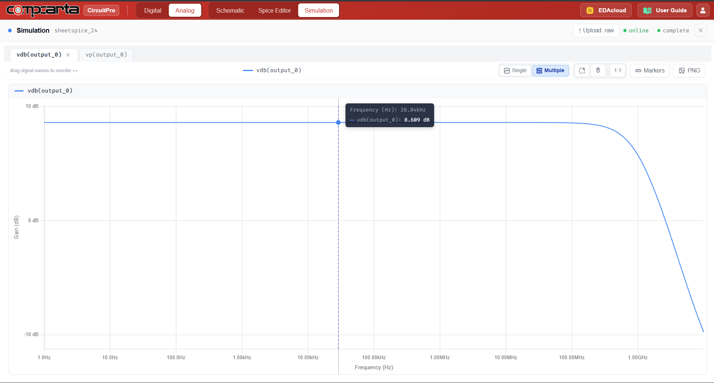
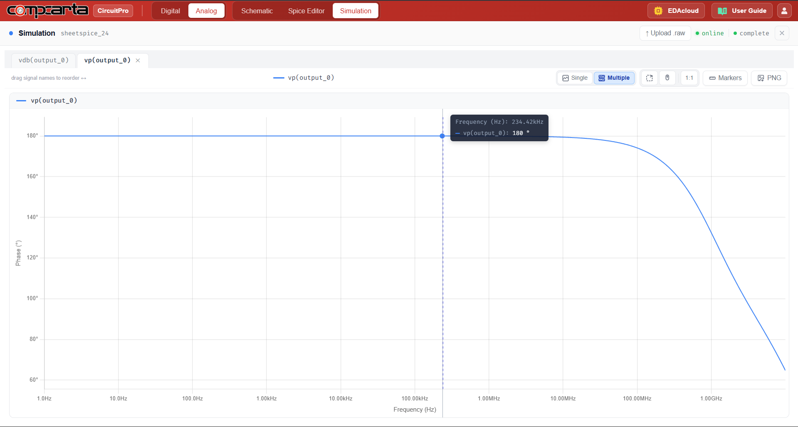

# CM-DC-02 — NMOS Common-Source with PMOS Active Load
**Category:** Amps | **Complexity:** Intermediate | **Analysis:** DC + AC | **VDD:** 1.8V

## Overview
A classic single-stage amplifier with an NMOS common-source transistor and a diode-connected PMOS as the active load. The active load replaces a resistive drain resistor and significantly increases the output impedance, which directly increases voltage gain. The DC bias is set to place the output near VDD/2, and the AC gain is measured and compared against what a resistive load would give.

## Sizing
| Device | W (µm) | L (µm) |
|:-------|-------:|-------:|
| NMOS   |   4.00 |   0.35 |
| PMOS   |   4.00 |   0.35 |

## Test Setup
- NMOS biased at ID = 100µA via gate voltage
- DC sweep to verify Q-point near VDD/2
- AC sweep to extract voltage gain Av = −gm·(ron ∥ rop)

## Results

| Metric     | Target            | Result  |
|:-----------|:-------------------|:--------|
| Av         | > 15 V/V           | ✅ Pass |
| Q-point    | VDD/2 ± 20%         | ✅ Pass |
| Phase at DC| ~180° (inverting)   | ✅ Pass |

## Key Insight
The diode-connected PMOS load presents an impedance of 1/gmp in parallel with romp. Since 1/gmp is much smaller than romp, the effective load impedance is roughly 1/gmp — still higher than a typical resistor at this bias current, giving meaningfully more gain without needing a large supply headroom.

## Files
| File                                       | Description                  |
|:--------------------------------------------|:------------------------------|
| `schematic.png`                             | Circuit schematic             |
| `schematic_raw.json`                        | CircuitPro schematic export   |
| `results/ac_gain_frequency_response.png`    | Voltage gain vs frequency     |
| `results/ac_phase_frequency_response.png`   | Phase vs frequency            |
