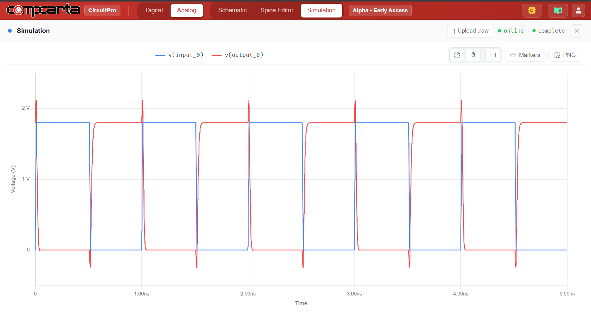

# CM-Tran-01 — CMOS Inverter Propagation Delay vs Load Capacitance
**Category:** Logic | **Complexity:** Basic | **Analysis:** Transient | **VDD:** 1.8V

## Overview
Same inverter as CM-DC-01 but now tested dynamically. A 1GHz square wave drives the input and the output is measured across four different load capacitances (1, 5, 10, 20fF). The goal is to extract tpHL and tpLH at each load and confirm the expected linear relationship between delay and CL. This is how sky130 cell delay is characterized in practice.

## Sizing
| Device | W (µm) | L (µm) |
|:-------|-------:|-------:|
| NMOS   |   0.42 |   0.15 |
| PMOS   |   0.84 |   0.15 |

## Test Setup
- Input: 1GHz square wave, 0 → 1.8V
- CL stepped: 1, 5, 10, 20fF
- tpHL and tpLH measured at 50% crossing points
- Linear fit (R²) extracted from delay vs CL plot

## Results

| Metric        | Target    | Result  |
|:--------------|:----------|:--------|
| tpd at CL=1fF | < 30ps    | ✅ Pass |
| tpHL ≈ tpLH   | Symmetric | ✅ Pass |
| Linearity     | R² > 0.99 | ✅ Pass |

## Key Insight
Delay scales linearly with load capacitance as expected from tpd = 0.69·R·CL. The intrinsic delay (y-intercept of the linear fit) represents the minimum gate delay with no external load — a useful benchmark against sky130 library values.

## Files
| File                                            | Description                  |
|:-----------------------------------------------------|:-----------------------------------|
| `schematic.png`                                        | Circuit schematic                  |
| `schematic_raw.json`                                   | CircuitPro schematic export        |
| `results/propagation_delay_tphl_tplh.png`              | Delay measurement waveform         |
| `results/input_output_transient_waveform.png`          | Input/output transient             |
