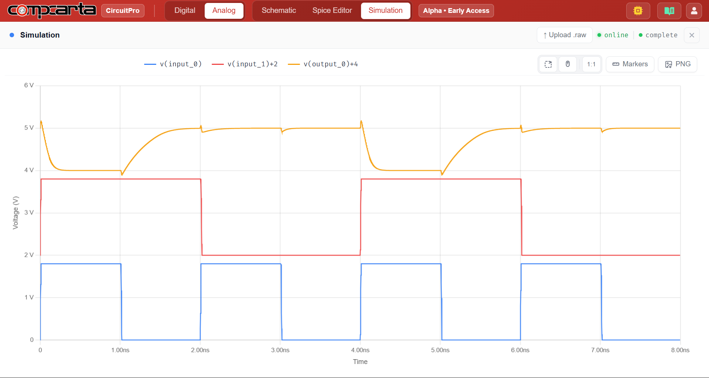

# CM-Tran-02 — CMOS NAND2 Gate — Function and Timing

**Category:** Logic | **Complexity:** Basic | **Analysis:** Transient | **VDD:** 1.8V

## Overview

A two-input CMOS NAND gate built with two series NMOS transistors for pull-down and two parallel PMOS transistors for pull-up. All four input combinations are applied and the output is verified against the NAND truth table. The worst-case propagation delay (both inputs switching HIGH→LOW simultaneously) is extracted and compared against NOR2 in the next experiment.

## Sizing

| Device | W (µm) | L (µm) |
|:-------|-------:|-------:|
| NMOS   |   0.42 |   0.15 |
| PMOS   |   1.68 |   0.15 |

PMOS is sized at 4× NMOS here because two PMOS devices are in series during pull-up — wider devices compensate for the added resistance.

## Test Setup

- All 4 input combinations applied at 500MHz
- Output logic levels verified against truth table
- Worst-case tpHL identified (both inputs HIGH → output LOW)

## Results

| Metric              | Target       | Result  |
|:--------------------|:-------------|:--------|
| Boolean function    | Correct NAND | ✅ Pass |
| Worst-case tpHL     | Identified   | ✅ Pass |
| Output logic levels | Rail-to-rail | ✅ Pass |

## Key Insight

The two series NMOS transistors create a slow pull-down path when both inputs are HIGH — this is the worst-case timing condition for NAND. Understanding this asymmetry is essential before sizing any standard cell.

## Files

| File                                      | Description                 |
|:------------------------------------------|:----------------------------|
| `schematic.png`                           | Circuit schematic           |
| `schematic_raw.json`                      | CircuitPro schematic export |
| `results/nand2_input_output_waveform.png` | Truth table + timing        |
