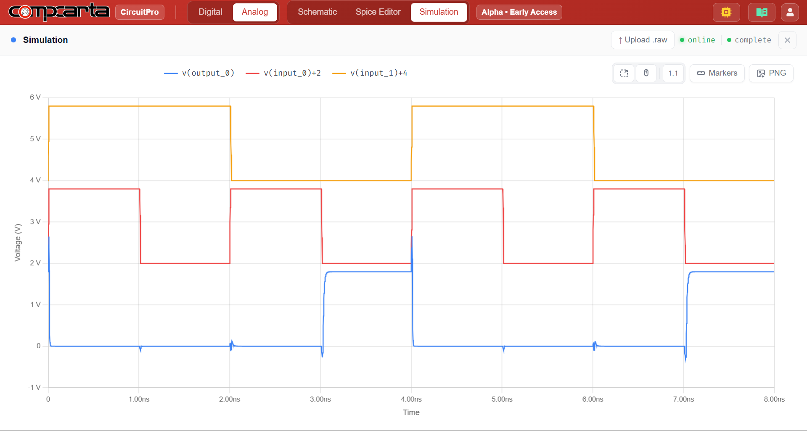

# CM-Tran-03 — CMOS NOR2 Gate — Function and Timing

**Category:** Logic | **Complexity:** Basic | **Analysis:** Transient | **VDD:** 1.8V

## Overview

A two-input CMOS NOR gate with two parallel NMOS transistors for pull-down and two series PMOS transistors for pull-up. This is the dual of the NAND2 circuit. The worst-case delay here is tpLH (both inputs LOW → output HIGH) because two PMOS transistors in series create a slow pull-up path. Comparing this against NAND2 shows why NOR gates are generally slower in standard CMOS.

## Sizing

| Device | W (µm) | L (µm) |
|:-------|-------:|-------:|
| NMOS   |   0.84 |   0.15 |
| PMOS   |   0.84 |   0.15 |

## Test Setup

- All 4 input combinations applied at 500MHz
- Output logic levels verified against truth table
- Worst-case tpLH identified (both inputs LOW → output HIGH)

## Results

| Metric              | Target      | Result  |
|:--------------------|:------------|:--------|
| Boolean function    | Correct NOR | ✅ Pass |
| Worst-case tpLH     | Identified  | ✅ Pass |
| Output logic levels | Rail-to-rail| ✅ Pass |

## Key Insight

Series PMOS in the pull-up network is the NOR gate's bottleneck — the exact mirror of the series NMOS bottleneck in NAND. This is why NAND-based logic dominates in most digital standard cell libraries.

## Files

| File                                     | Description                 |
|:-----------------------------------------|:----------------------------|
| `schematic.png`                          | Circuit schematic           |
| `schematic_raw.json`                     | CircuitPro schematic export |
| `results/nor2_input_output_waveform.png` | Truth table + timing        |
