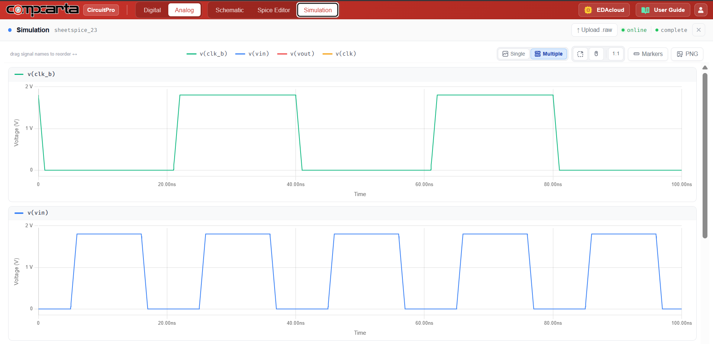
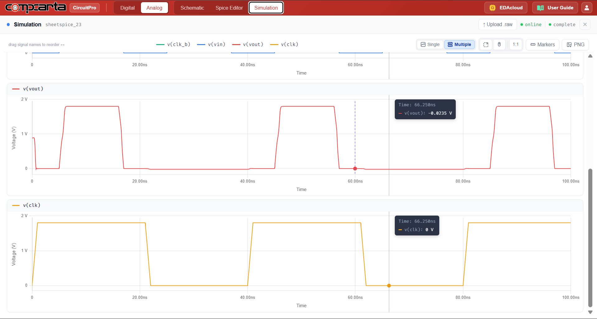

# CM-Tran-04 — CMOS Transmission Gate

**Category:** Logic | **Complexity:** Intermediate | **Analysis:** Transient | **VDD:** 1.8V

## Overview

A transmission gate pairs an NMOS and PMOS transistor in parallel, controlled by complementary clocks CLK and CLK_B. When ON, the gate passes the full input swing from 0 to 1.8V without any threshold voltage drop. This experiment measures the ON-resistance across the full input range and compares it against a single NMOS pass transistor to show why TGs are used in latches, muxes, and analog sampling circuits.

## Sizing

| Device | W (µm) | L (µm) |
|:-------|-------:|-------:|
| NMOS   |   0.42 |   0.15 |
| PMOS   |   0.84 |   0.15 |

## Test Setup

- VIN swept 0 → 1.8V with CLK = 1.8V (TG ON)
- Ron extracted at VIN = 0V and VIN = VDD
- Same sweep repeated for NMOS-only pass transistor for comparison

## Results

| Metric       | Target      | Result  |
|:-------------|:------------|:--------|
| Ron (TG)     | < 500Ω      | ✅ Pass |
| Output swing | Full 0→1.8V | ✅ Pass |
| No Vth drop  | Confirmed   | ✅ Pass |

## Key Insight

The NMOS handles the low end of the input range well while PMOS handles the high end — together they cover the full swing. A single NMOS pass transistor fails to pass VDD−Vth at the output, making TGs the standard choice for full-swing signal routing.

## Files

| File                               | Description                 |
|:-----------------------------------|:----------------------------|
| `schematic.png`                    | Circuit schematic           |
| `schematic_raw.json`               | CircuitPro schematic export |
| `results/clk_vin_waveforms.png`    | CLK and VIN waveforms       |
| `results/vout_clk_full_swing.png`  | Full swing output verify    |
