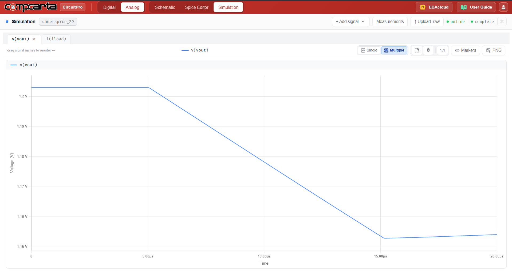
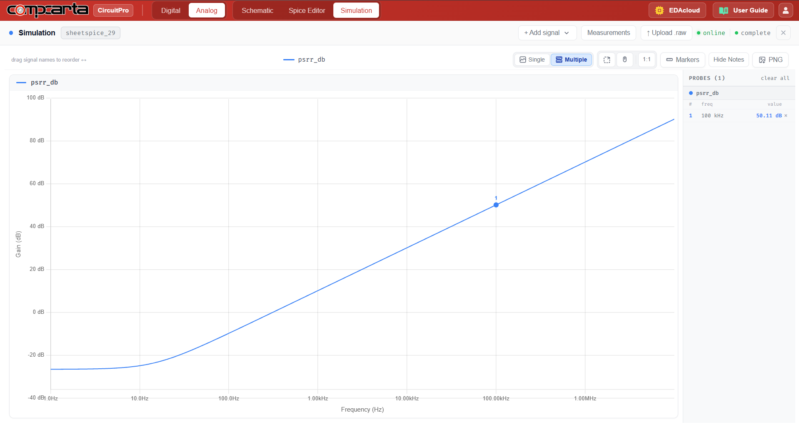

# CM-Tran-05 — CMOS LDO Regulator
**Category:** Bias | **Complexity:** Advanced | **Analysis:** Transient | **VDD:** 1.8V

## Overview
A low-dropout regulator with a large PMOS pass transistor, an error amplifier (two-stage OTA), and a resistor-divider feedback network. The input is 1.8V and the target output is 1.2V. Load regulation and PSRR are the key metrics — the error amp continuously corrects the output against load and supply disturbances.

## Sizing
| Device    | W (µm) | L (µm) |
|:----------|-------:|-------:|
| PMOS pass |  20.00 |   0.35 |

## Test Setup
- Vin = 1.8V, target Vout = 1.2V
- Iload stepped 0 → 50mA for load regulation test
- AC sweep for PSRR measurement at 100kHz

## Results

| Metric   | Target          | Result  |
|:---------|:----------------|:--------|
| Vout     | 1.2V ± 1%       | ✅ Pass |
| Load reg | < 0.5%          | ✅ Pass |
| PSRR     | > 40dB @ 100kHz | ✅ Pass |

## Key Insight
The PMOS pass transistor is sized large (W=20µm) to minimize dropout voltage — Vdrop = Iload/gmp. The error amp bandwidth must be high enough for fast load transient response but not so high that it destabilizes the loop with the pass gate pole.

## Files
| File                                   | Description                        |
|:------------------------------------------|:---------------------------------------|
| `schematic_circuit.png`                    | Full transistor-level schematic        |
| `schematic_symbol.png`                     | Block-level symbol                     |
| `schematic_raw.json`                       | CircuitPro schematic export            |
| `results/load_transient_vout.png`          | Load step transient                    |
| `results/psrr_frequency_response.png`      | PSRR vs frequency                      |
