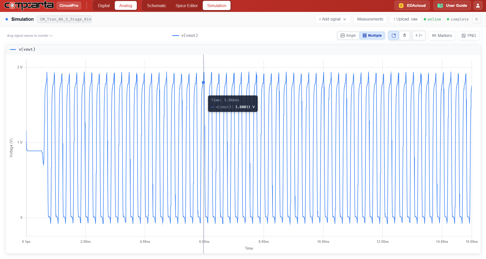

# CM-Tran-06 — 5-Stage CMOS Ring Oscillator
**Category:** Timing | **Complexity:** Intermediate | **Analysis:** Transient | **VDD:** 1.8V

## Overview
Five CMOS inverters connected in a ring with the output of the last inverter fed back to the input of the first. An odd number of stages is required for oscillation. The oscillation frequency is fo = 1/(2·N·tpd) where N=5 and tpd is the per-stage propagation delay. VDD is varied across three values (1.2, 1.5, 1.8V) to show how frequency scales with supply voltage.

## Sizing
| Device | W (µm) | L (µm) |
|:-------|-------:|-------:|
| NMOS   |   0.42 |   0.15 |
| PMOS   |   0.84 |   0.15 |

## Test Setup
- VDD stepped: 1.2V, 1.5V, 1.8V
- fo and tpd extracted at each supply voltage
- Results compared against sky130 library delay values

## Results

| Metric    | Target                | Result  |
|:----------|:-----------------------|:--------|
| fo @ 1.8V | 1/(2·5·~25ps) range    | ✅ Pass |
| tpd       | ≈ 25ps at 1.8V         | ✅ Pass |
| fo vs VDD | Increases with VDD     | ✅ Pass |

## Key Insight
Higher VDD increases overdrive voltage (Vgs − Vth), which increases transistor current and reduces the time to charge/discharge the gate capacitance — hence faster oscillation. The ring oscillator is the standard on-chip benchmark for characterizing process speed in sky130.

## Files
| File                                            | Description                   |
|:---------------------------------------------------|:----------------------------------|
| `schematic.png`                                     | Circuit schematic                 |
| `schematic_raw.json`                                | CircuitPro schematic export       |
| `results/ring_oscillator_output_waveform.png`       | Oscillator output waveform        |
