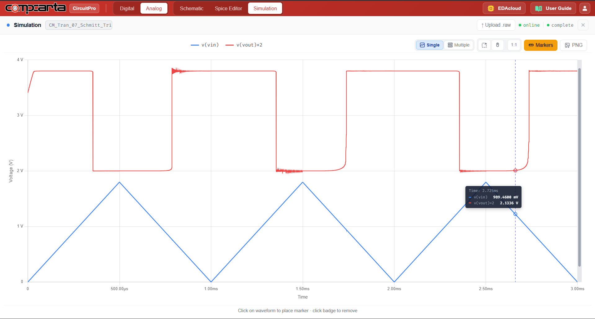
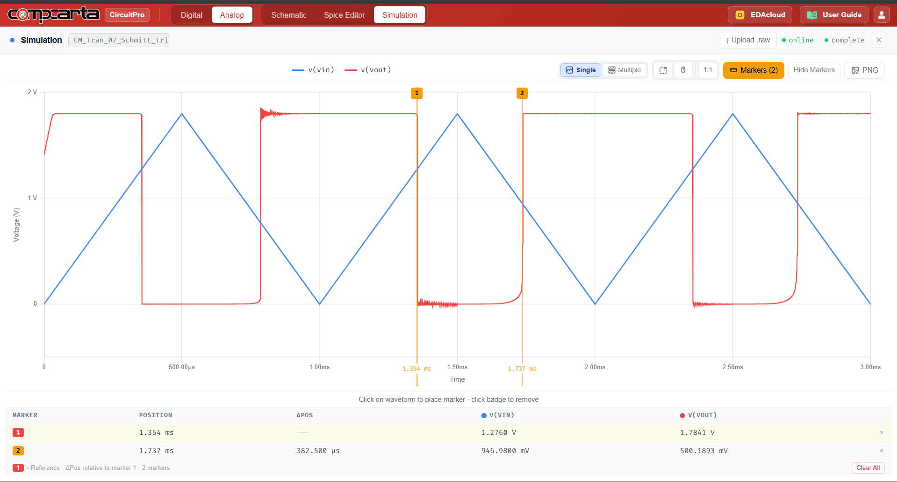

# CM-Tran-07 — CMOS Schmitt Trigger Inverter
**Category:** Timing | **Complexity:** Intermediate | **Analysis:** Transient | **VDD:** 1.8V

## Overview
A 6-transistor CMOS Schmitt trigger with positive feedback devices (PM2, NM2, NM3) that create hysteresis in the switching threshold. The upper threshold VT+ and lower threshold VT− are different, so the output does not switch at the same input voltage on the rising and falling edges. This makes the circuit immune to slow or noisy input signals — widely used in oscillators, input buffers, and debounce circuits.

## Sizing
| Device | W (µm) | L (µm) |
|:-------|-------:|-------:|
| NMOS   |   0.42 |   0.15 |
| PMOS   |   0.84 |   0.15 |

## Test Setup
- Vin: 1kHz triangle wave ramping 0 → 1.8V → 0V
- VT+ and VT− extracted from rising and falling edge crossings
- Hysteresis = VT+ − VT− measured

## Results

| Metric     | Target    | Result  |
|:-----------|:----------|:--------|
| Hysteresis | > 0.2V    | ✅ Pass |
| VT+ > VM   | Confirmed | ✅ Pass |
| VT− < VM   | Confirmed | ✅ Pass |

## Key Insight
The feedback transistors effectively shift the switching threshold depending on the current output state. When Vout is HIGH, the feedback PMOS lowers VT+; when Vout is LOW, the feedback NMOS raises VT−. The width ratio of the feedback devices to the main devices sets the hysteresis window.

## Files
| File                                          | Description               |
|:--------------------------------------------------|:-------------------------------|
| `schematic.png`                                    | Circuit schematic               |
| `schematic_raw.json`                               | CircuitPro schematic export     |
| `results/hysteresis_vin_vout_waveform.png`         | Hysteresis waveform             |
| `results/hysteresis_vin_vout_markers.png`          | Threshold markers               |
