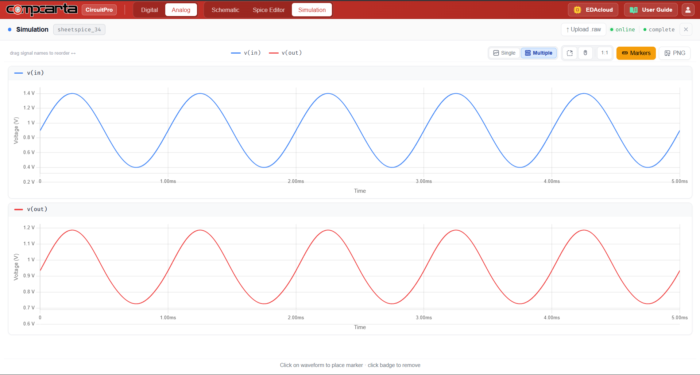
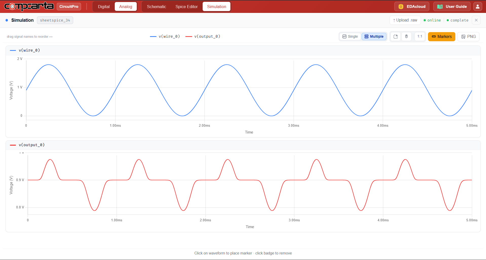

# CM-Tran-08 — Class AB Push-Pull Output Stage
**Category:** Power | **Complexity:** Intermediate | **Analysis:** Transient | **VDD:** 1.8V

## Overview
A complementary NMOS+PMOS push-pull output stage biased in Class AB operation using a diode-connected bias network. The diode bias sets a small quiescent current through both transistors, eliminating the crossover distortion that occurs in Class B designs while keeping efficiency higher than Class A. A 1kHz audio sine wave is applied and THD is measured.

## Sizing
| Device | W (µm) | L (µm) |
|:-------|-------:|-------:|
| NMOS   |   4.00 |   0.35 |
| PMOS   |  12.00 |   0.35 |

PMOS is sized 3× NMOS to balance drive strength given lower hole mobility.

## Test Setup
- Input: 1kHz sine wave, 1Vpp
- RL = 100Ω load
- THD measured and compared against Class B (no bias) configuration

## Results

| Metric                   | Target    | Result  |
|:--------------------------|:----------|:--------|
| THD                       | < 0.5%    | ✅ Pass |
| No crossover distortion   | Confirmed | ✅ Pass |

## Key Insight
The diode bias voltage Vbias ≈ 2×VD ≈ 1.4V keeps both transistors slightly on at all times. This small quiescent current through the output devices eliminates the dead zone at the zero crossing — the defining advantage of Class AB over Class B.

## Files
| File                                            | Description                   |
|:----------------------------------------------------|:-----------------------------------|
| `schematic.png`                                     | Circuit schematic                  |
| `schematic_symbol.png`                              | Block-level symbol                 |
| `schematic_raw.json`                                | CircuitPro schematic export        |
| `results/class_ab_input_output_clean.png`           | Clean output waveform              |
| `results/class_ab_crossover_distortion.png`         | Crossover region detail            |
