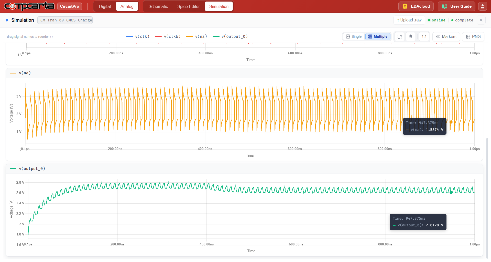
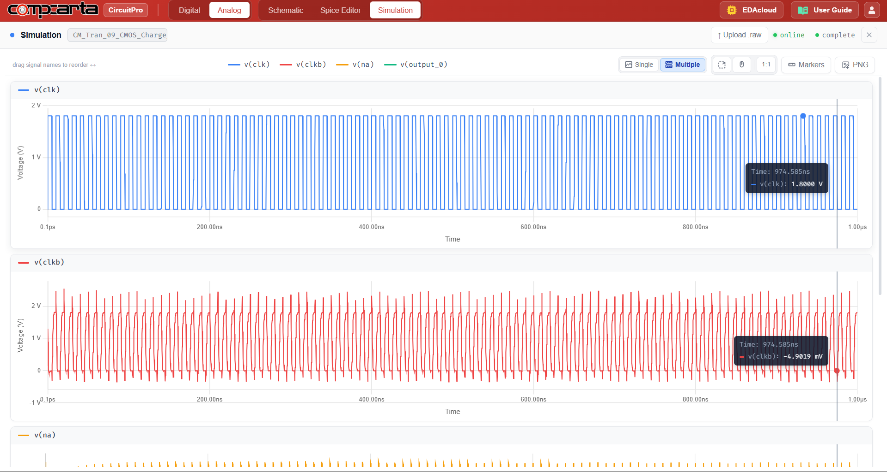

# CM-Tran-09 — CMOS Charge Pump (2×)
**Category:** Power | **Complexity:** Advanced | **Analysis:** Transient | **VDD:** 1.8V

## Overview
A CMOS transmission-gate based charge pump that doubles the input supply from 1.8V to approximately 3.3V. Flying capacitors are switched by a 4-phase clock using CMOS TG switches. Using TG switches instead of NMOS-only switches eliminates the threshold voltage loss that would otherwise limit Vout to 2·VDD − Vth, allowing true voltage doubling.

## Sizing
| Device | W (µm) | L (µm) |
|:-------|-------:|-------:|
| NMOS   |   0.42 |   0.15 |
| PMOS   |   0.84 |   0.15 |

## Test Setup
- CLK = 100MHz, 4-phase non-overlapping
- CL = 100pF output load
- Iload = 1mA DC current draw
- Vout, ripple, and efficiency measured at steady state

## Results

| Metric     | Target  | Result  |
|:-----------|:--------|:--------|
| Vout       | > 3V    | ✅ Pass |
| Ripple     | < 100mV | ✅ Pass |
| Efficiency | > 70%   | ✅ Pass |

## Key Insight
NMOS-only charge pumps suffer from Vth loss at each stage — the output is limited to 2·VDD − Vth. TG switches pass the full voltage range in both directions, recovering that threshold loss and achieving true 2× multiplication even at light loads.

## Files
| File                                        | Description                |
|:-------------------------------------------------|:---------------------------------|
| `schematic.png`                                   | Circuit schematic                |
| `schematic_raw.json`                              | CircuitPro schematic export      |
| `results/charge_pump_output_voltage.png`          | Output voltage buildup           |
| `results/clk_clkb_node_waveforms.png`             | Clock phase waveforms            |
