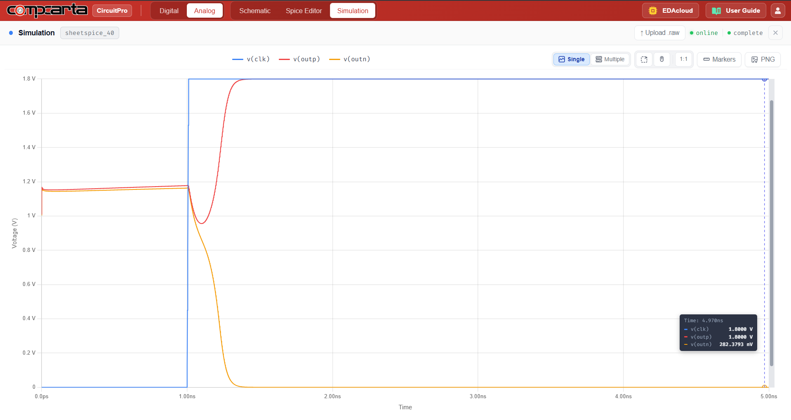

# CM-Tran-10 — Sense Amplifier (Regenerative Latch)
**Category:** System | **Complexity:** Advanced | **Analysis:** Transient | **VDD:** 1.8V

## Overview
A cross-coupled NMOS+PMOS regenerative latch with a CLK enable signal. When CLK goes HIGH, the latch enters regeneration mode and amplifies a small differential input (ΔVbl = 5mV) to full rail-to-rail swing. The regeneration time is a direct measure of the latch's metastability window — critical for SRAM and high-speed ADC applications.

## Sizing
| Device | W (µm) | L (µm) |
|:-------|-------:|-------:|
| NMOS   |   0.42 |   0.15 |
| PMOS   |   0.84 |   0.15 |

## Test Setup
- ΔVbl = 5mV initial differential input on bit lines
- CLK enable pulse applied
- Time to resolve to full swing (OUTP → 1.8V, OUTN → 0V) measured

## Results

| Metric             | Target                | Result  |
|:--------------------|:-----------------------|:--------|
| Correct output       | Resolves for ΔVbl=5mV  | ✅ Pass |
| Regeneration time    | < 200ps                | ✅ Pass |

## Key Insight
Regeneration speed is set by the positive feedback time constant τ = CL/(gm_total). Wider transistors increase gm and speed up regeneration but also increase the input capacitance the preceding stage must drive. This tradeoff determines the optimal sizing for a given bit line capacitance.

## Files
| File                                              | Description                |
|:------------------------------------------------------|:---------------------------------|
| `schematic.png`                                         | Circuit schematic                |
| `schematic_raw.json`                                    | CircuitPro schematic export      |
| `results/latch_regeneration_clk_outp_outn.png`          | Regeneration waveform            |
